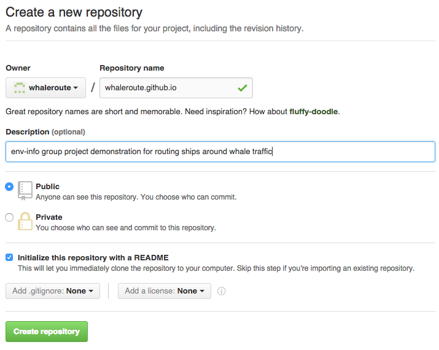
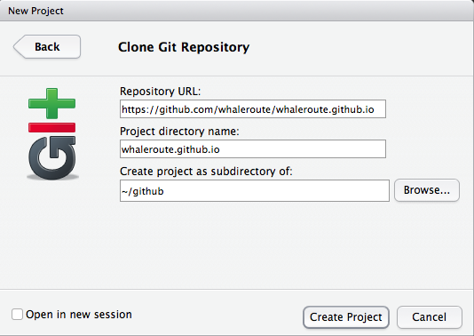

## Schedule

1. 8:30 - 9:30 am

    Github finish: [Git lecture, II](gitpart2.pdf) [15 min, NT]
    Assign [env-info groups](https://docs.google.com/document/d/1scKj-5vp3BORXivj9JZxKCUJdIdp6kQ5yGemHRzEP2U/edit?usp=sharing) [5 min]
    [Doodle preferred office hours for BB](http://doodle.com/poll/e44g8w79s9i5swy8) by 5pm today  
    [Git Assignment (Group)](#git-assignment-(group)), to create Github organization and respository  [30 min, per group]
    [Rmarkdown lecture](./rmarkdown.html) & demo [BB, 30 min]
    
1. 9:30 - 10:30 am

    Break [10 min]
    [RMarkdown Assignment (Individually)](#rmarkdown-assignment-(individually)) to add student listing [30 min, individually]
    Programming concepts lecture [Programming Lecture](programming.full.pdf) [20 min, NT]

1. 10:30 - 11:30 am

    Programming exercise I [20 min, individually]
    More on Programming [20 min, NT]
    Programming exercise II [20 min, individually]

### Github Demo II [NT]

    # list git log in reverse order
    git log --reverse
    
    # go back in time
    git reset #commit#
    
    # go back and delete all subsequent commits!
    git revert #commit# --hard

## Assignment

### Git Assignment (Group)

1. Assign yourself to an [env-info group](https://docs.google.com/document/d/1scKj-5vp3BORXivj9JZxKCUJdIdp6kQ5yGemHRzEP2U/edit?usp=sharing)

2. The first person listed in the group should [Create a new Github organization](https://help.github.com/articles/creating-a-new-organization-from-scratch/) (eg `<organization>` is `whaleroute`) and [Add organization members to the owner team](https://help.github.com/articles/adding-organization-members-to-a-team/) (eg owner `bbest` adds username `naomitague`).

3. The first person listed in the group should also [Create a repository](https://help.github.com/articles/create-a-repo/) with Owner set to your organization (eg `whaleroute`, not your default username) and name it after your Github `<organization>.github.io` (eg `whaleroute.github.io`). Tick the box to initialize this repository with a README.

    

    This repository will store your organization's website files, so the repository of files at `http://github.com/<organization>/<organization>.github.io` (eg <http://github.com/whaleroute/whaleroute.github.io>) will eventually be viewable at `http://<organization>.github.io` (eg <http://whaleroute.github.io>), but only after you add an index.html, per [pages.github.com](https://pages.github.com). That will come later, after you learn RMarkdown. For now you'll use this repository to work on your Git and Github skills.

4. Now every member of the group should obtain this repository onto your local machine for editing, ie `git clone`. You can do this via RStudio menu File, New Project..., Version Control, Git. Substitute with your own `<organization>` like below (not `whaleroute`):

    

5. Finally, time to play with [Git/Github in RStudio](http://r-pkgs.had.co.nz/git.html#git-status) to make changes for your group's data analysis.
    * Write a short Rscript to read or generate some data, manipulate it and plot it 
    * Commit your file to the local repository and Push to the Github respository; 
    * Have everyone in the group make some changes to the script. Commit them locally and then Push to Github.
    * Make a new branch, make some changes; commit them (locally)
    * Merge your fork to the main branch
    * Make an error, commit it
    * Go back!
    * Commit and push to Github

### RMarkdown Assignment (Individually)

Add yourself to the [students]({{ site.baseurl }}/students/) listing with a json <sup><a href="#json">1</a></sup> file, and a dedicated Rmarkdown document.

1. [Fork](https://help.github.com/articles/fork-a-repo/) the [ucsb-bren/env-info](https://github.com/ucsb-bren/env-info) repository into your Github user space, and clone the repository `<username>/env-info` to your laptop to work on files, similar to how you previously cloned `<organization>/<organization>.github.io` (via RStudio menu File, New Project..., Version Control, Git). All paths below refer to wherever you cloned the `env-info` repo onto your local machine.

1. Add yourself the [students]({{ site.baseurl }}/students/) listing by adding a file per your Github `<username>.json` into the [`_data/`](_data/) directory. Here's an example for Github username `bbest`, so the file is at [`_data/bbest.json`](https://github.com/ucsb-bren/env-info/blob/gh-pages/_data/bbest.json):
        
        {
        	"program": "lecturer",
        	"interests": "marine ecology, species distribution modeling",
        	"project": "route ships around marine mammal hotspots",
        	"organization": "whaleroute"
        }

    Using the format above, replace with your own `program` (eg `"MS"` or `"PhD"`), `interests` and `project` idea. Leave `organization` blank for now; you'll update that once you've identified your group below.

    Commit and push your changes and make a new pull request. Once your new pull request gets accepted by @bbest / @naomitague, you should see the updated [students]({{ site.baseurl }}/students/) listing with your organization linked to your [`<organization>.github.io`](http://<organization>.github.io).
    
1. The [students]({{ site.baseurl }}/students/) listing generated from the \*.json files (using jekyll <sup><a href="#jekyll">2</a></sup> ) links your user information to a details page at `students/<username>.html`. Create this using an Rmarkdown document (in RStudio, File > New File > R Markdown... Document in HTML format), so save it initially as `<username>` under the `students` folder and it will default to save as `<username>.Rmd` (ie `students/<username>.Rmd`). Click the "Knit HTML" as you go to render the `students/<username>.html`.

    - Add the following headings to your Rmd and replace the text below with your own content based on overlap with the course and your interests:
    
            ## Content
            
            What is your burning environmental question that you'd like to address? Feel free to provide group project, dissertation, and/or personal interest. What's the study area?
            
            ## Techniques
            
            What techniques from the course do you think will be most applicable?
            
            ## Data
            
            What data have you already identified? Feel free to provide a link and/or details on the variables of interest.
        
    - For details on Rmarkdown syntax, see:
    
        - RStudio menu Help > [Markdown Quick Reference](http://rmarkdown.rstudio.com/authoring_basics.html)
        - RStudio menu Help > Cheatsheets > [R Markdown Cheat Sheet]({{ site.baseurl }}/refs/cheatsheets/rmarkdown-cheatsheet.pdf)
        - RStudio menu Help > Cheatsheets > [R Markdown Reference Guide]({{ site.baseurl }}/refs/cheatsheets/rmarkdown-reference.pdf)

    - For instance, you could add an image into `students/images/cool_idea.png` using Mac Finder or Windows Explorer, and incorporate this into your `students/<username>.Rmd` by adding a line like:
    
            
            
    - For this to work on the <http://ucsb-bren.github.io/env-info> site, you'll need to commit and push the knitted `<username>.html` and `images/cool_idea.png` files. Play with formatting to add at least one italic, bold, list, link, and image.
    
    - Next, [add a table of contents](http://rmarkdown.rstudio.com/html_document_format.html#table-of-contents) by replacing the front matter line (in YAML <sup><a href="#yaml">3</a></sup>):
    
          output: html_document
    
      with
      
          output:
            html_document:
              toc: true
              toc_depth: 2
    
    - Next, [add a chunk of R code](http://rmarkdown.rstudio.com/authoring_rcodechunks.html) to read a csv <sup><a href="#csv">4</a></sup> data file and output a summary, like:
    
          ```{r}
          # read csv
          d = read.csv('bbest_ports.csv')
          
          # output summary
          summary(d)
          ```
          
      Try to use data relevant to your question of interest, and be sure to copy the csv data file into the `students/data` folder, preferably with a file name like `<username>_<dataname>.csv`. If you have trouble finding data, explore the links in [Data]({{ site.baseurl }}/data/).
    
    - Be sure to run the "Knit HTML" on your `students/<username>.Rmd` to generate the final desired `students/<username>.html`
    
    Add a link to your organization (from Group exercies)

1. Commit, push and pull request your changes, per [Github Workflow](../wk00_general/intro.html#8). This is how you'll turn in this assignment. 

    **Review**. We can provide line-by-line feedback directly within the pull request as part of a code review. You could even follow up with submitting corrections by pushing fixes up to your fork, which will be reflected in the pull request. When we're finished giving feedback, we'll close the pull request and leave a :+1: in the final comment.

### Programing Assignment (Group)

1. Write a function in R to do some data analysis or simulation that your group will find interesting
    * include at least two different data types
    * return a list
    * include at least two different control structures
    * make sure you document your program
2. Add this function to your organization's github repository - Note this is how we will check to make sure you have completed the assignment - so make sure that your student listing has a link to your group's organization and that you have committed and pushed your function to that organization's respository

## Resources

### Fixing `rpostback-askpass` error

If you get this `rpostback-askpass` error on a Mac when pushing in RStudio, see [rpostback-askpass error on Mac doing Git Push from RStudio to Github · Issue #2 · ucsb-bren/env-info](https://github.com/ucsb-bren/env-info/issues/2):

```
error: unable to read askpass response from 'rpostback-askpass'
fatal: could not read Username for 'https://github.com': Device not configured
```

### Git, Github and RStudio

- [Git and GitHub Cheat Sheet]({{ site.baseurl }}/refs/github-git-cheat-sheet.pdf)
- [Git and GitHub · R packages](http://r-pkgs.had.co.nz/git.html)

### Rmarkdown

- [Markdown Quick Reference](http://rmarkdown.rstudio.com/authoring_basics.html)
- [R Markdown Cheat Sheet]({{ site.baseurl }}/refs/cheatsheets/rmarkdown-cheatsheet.pdf)
- [R Markdown Reference Guide]({{ site.baseurl }}/refs/cheatsheets/rmarkdown-reference.pdf)
- [Mastering Markdown · GitHub Guides](https://guides.github.com/features/mastering-markdown/)

## Footnotes

### json

[JavaScript Object Notation](http://www.json.org/) (json) is a lightweight data format, which is both human and machine readable with complex hierarchies like XML, but more compact (and less explicit with tags).

### jekyll

[Jekyll](http://jekyllrb.com/docs/home/) is a static site generator used by [Github Pages](https://pages.github.com) (the website hosting capacity of Github, since default view of HTML is as code not rendered form) using the liquid templating language which has limited [data file support](http://jekyllrb.com/docs/datafiles/) for JSON in the [`_data`](https://github.com/ucsb-bren/env-info/tree/gh-pages/_data) folder for iterating through JSON file objects like in [`students/index.md`](https://raw.githubusercontent.com/ucsb-bren/env-info/gh-pages/students/index.md) and wrapping the template in [`layouts/default.html`](https://github.com/ucsb-bren/env-info/blob/gh-pages/_layouts/default.html) which uses the [`_includes`](https://github.com/ucsb-bren/env-info/tree/gh-pages/_includes) to provide a common navigational bar for the site to yield the final [`students/index.html`](http://ucsb-bren.github.io/env-info).

### yaml

[YAML](https://en.wikipedia.org/wiki/YAML) is a human readable format for storing variables of various types (single values, lists, arrays) in a language agnostic manner. It's commonly used in configuration files, and any modern language would have a library for reading and writing this format (eg [yaml](https://cran.r-project.org/web/packages/yaml) for R).

### csv

[CSV](https://en.wikipedia.org/wiki/Comma-separated_values), Comma-separated_value, files store data in a human and machine readable format in which rows of data are seperated by a newline, and columns by a comma. This format is probably the most widespread for sharing tabular data, and is read by most database and spreadsheet programs, including Excel. CSV files are also nicely [rendered in Github](https://help.github.com/articles/rendering-csv-and-tsv-data/) with column formatting, searching and even [line-by-line linking](https://github.com/blog/1601-see-your-csvs). An emerging [standard](http://data.okfn.org/standards) for tabular data stores data in CSV form and the metadata (ie variable description, variable type, dataset source, citation, etc) as [JSON](#json).
